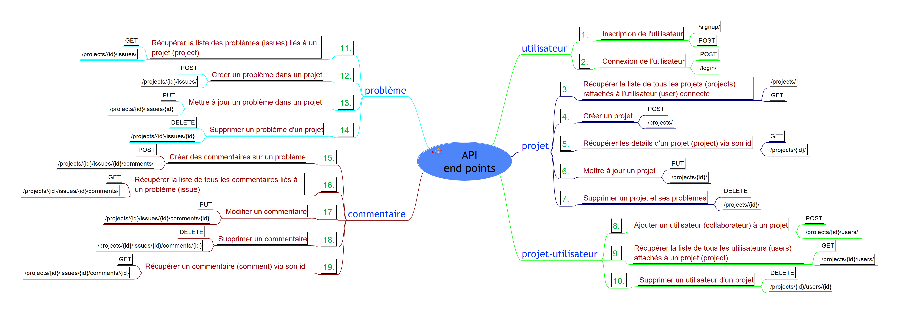
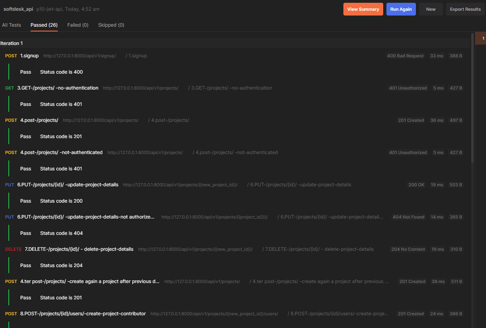
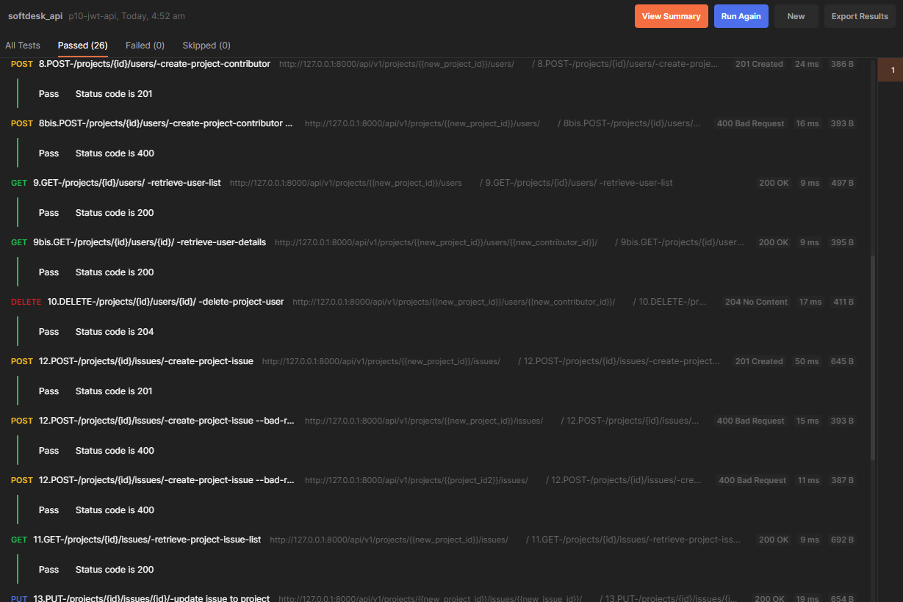
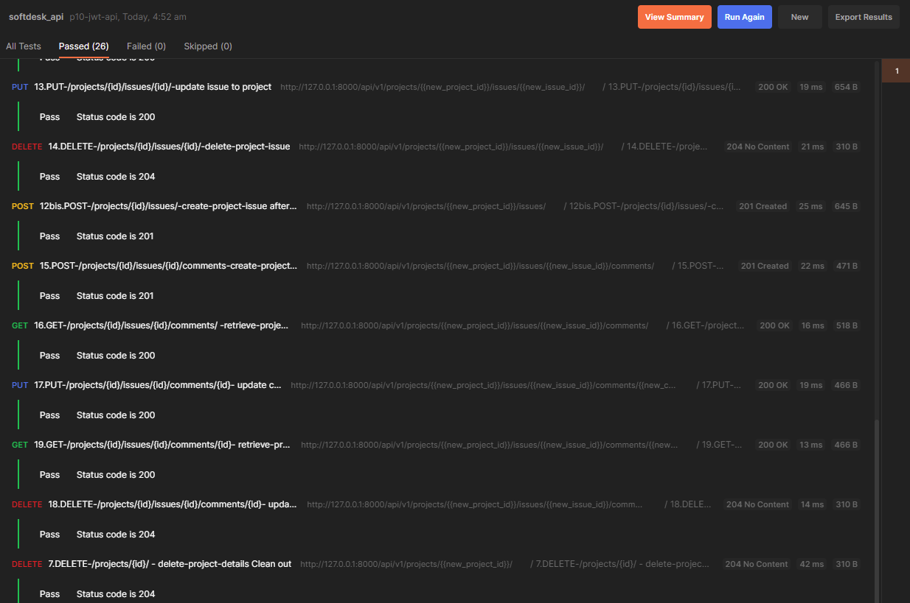
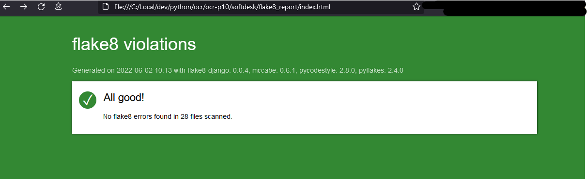

  

  


# ocr-p10 Créez une API sécurisée RESTful en utilisant Django REST

- [ocr-p10 Créez une API sécurisée RESTful en utilisant Django REST](#ocr-p10-créez-une-api-sécurisée-restful-en-utilisant-django-rest)
  - [Disclaimer](#disclaimer)
  - [Softdesk API documentation](#softdesk-api-documentation)
    - [Introduction](#introduction)
    - [Overview](#overview)
    - [Error Codes](#error-codes)
    - [Rate limit](#rate-limit)
    - [End Points description](#end-points-description)
  - [Quick start](#quick-start)
    - [Gestion des secrets](#gestion-des-secrets)
  - [Python Decouple: Strict separation of settings from code](#python-decouple-strict-separation-of-settings-from-code)
  - [Crédits et lectures intéressantes](#crédits-et-lectures-intéressantes)
  - [Tests passed](#tests-passed)
    - [Django ApiTestCase pass 6/6](#django-apitestcase-pass-66)
    - [Postman Test pass 26/26](#postman-test-pass-2626)
  - [PEP 8 check](#pep-8-check)


  
  
## Disclaimer

---

This code is part of the openclassrooms learning adventure split in 13 business alike projects.  
  
  
This one is to code a chess management app following the rules of Swiss tournament.  
Some materials or links may have rights to be granted by https://openclassrooms.com. 
The additionnal code follows "CC BY-SA ".
  
** Not to be used for production **  

---

## Softdesk API documentation

### Introduction

The SoftDesk API enables your helpdesk team to support your projects thru:

* reporting Issues on a per Project basis,
* allocating these Issues to team members for fixing,
* and collecting related Comments from other project members.

A set of 19 end points are provided to interact with the front end solution of your choice.

### Overview

We could suggest the following workflow to support a project:

1.    The user does log-in.
2.    The user creates a new project
3.    The user adds members to his project
4.    When it occurs, the user creates an open issue & assign it to one of his project members
5.    If needed he or any project member make comments about the issue
6.    When the assignee has fixed the point, the project responsible closes the issue.

The application structure includes basically 3 levels of embedded models : Project, Issues, Comments.

For these, the basic CRUD methods are provided thru the available end-points.

If you need a mock data set for testing purpose, here is what we suggest:

|user/project| 1  |  2 |  3 |  4 | 5 |
|------------|----|----|----|----|---|
| 1.adminoc  |    | A  |    |    |   |
| 2.JohnDoe  | A  |    | A  |  A |   |
| 3.JaneSmith| (M)|    |    |    | A |

(A)uthor ; (M)ember.

We provide two series of test: one of the back-end side and one on the Postman client side.

Fot the latter, remember when checking User permissions that "adminoc" is also the SoftDesk API superuser.
In the Project direction, the tested (C)reate/(U)pdate/(R)etrieve Issue or Comment will be removed thru (D)elete.

Our product is still under active developpement. Feel free to contact us for any questions or proposals of improvement.
Authentication

Only authenticated users can access the SoftDesk backend. In order to do so the user first needs to register by providing an email address. The same email with its associated password will be required to login at the back-end.

We do not use the collected emails for any purpose. Therefore, the provided email could also be a fake one.

SoftDesk API includes the Simple JWT package in order to provide JSON Web Token authentication. The current setting for the Token access and Token refresh life time are :

    'ACCESS_TOKEN_LIFETIME': timedelta(minutes=30),
    'REFRESH_TOKEN_LIFETIME': timedelta(days=1),

### Error Codes

Successful status codes:
```
HTTP_200_OK
HTTP_201_CREATED
HTTP_202_ACCEPTED
HTTP_203_NON_AUTHORITATIVE_INFORMATION
HTTP_204_NO_CONTENT
```


Error status codes:
```
HTTP_400_BAD_REQUEST
HTTP_401_UNAUTHORIZED
HTTP_403_FORBIDDEN
HTTP_404_NOT_FOUND
HTTP_500_INTERNAL_SERVER_ERROR
```

### Rate limit

No limits of request were set in version 1 of the SoftDesk API.


### End Points description

We did our best to throughfully document our solution. The updated version is hosted at : 
[Link to the official Softdesk API documentation, published @getpostman.com ](https://documenter.getpostman.com/view/19150435/Uz5DrdLm)  

  


  
## Quick start

  

Pour démarrer le serveur d'API en local 
sous le prompt bash python (ici cmd Anaconda3 sous Windows 10), vous pouvez:

1.  cloner l'ensemble du répertoire github dans un répertoire local dédié.
    `git clone https://github.com/dev-KC20/ocr-p10.git  
  
2.  se déplacer dans le sous répertoire de travail   
    `cd ocr-p10  
  
3. créer un environnement virtuel python, ENV  
    `python -m venv ENV  
  
4.  activer un environnement virtuel python, ENV  
    `ENV\scripts\activate.bat  

5.  installer les paquets requis,  
    `pip install -r requirements-dev.txt 

6.  se déplacer dans le répertoire de l'application:
    `cd softdesk     
  
7.  créer un fichier .env sous le répertoire courant afin de contenir les "secrets" (cf. plus bas) :  
     ``` 
        # SECURITY WARNING: keep the secret key used in production secret!  
        SECRET_KEY = blabla  
        DEBUG = True  
     ``` 
  
8.  exécuter la migration des modèles  
    `python manage.py migrate  
  
9.  exécuter le script serveur  
    `python manage.py runserver  
  
10. accéder coté client à l'application servie par Django en vous rendant @ :  
    http://127.0.0.1:8000/   
  
   


### Gestion des secrets

Django utilise un "secret" pour générer ses certificats et recommande de garder cette clé secrète. 
Nous utilisons le paquet python-decouple pour remplacer les clés de secret par leur valeur dans le fichier settings.py :
Le fait de stocker les secrets dans un fichier .env évite de le "committer" par accident sur un dépôt centralisé grâce au paramétrage de notre .gitignore.

S'agissant ici d'un exercice pédagogique, nous voulons permettre d'utiliser notre code source et éventuelles données tout en respectant les bonnes pratiques. C'est pourquoi nous autorisons exceptionnellement le commit du fichier .env.

```py
from decouple import config
...
SECRET_KEY = config("SECRET_KEY")

```

Références: 

**Gardez cette valeur secrète.**
Le fonctionnement de Django avec une clé [`SECRET_KEY`](https://docs.djangoproject.com/fr/4.0/ref/settings/#std:setting-SECRET_KEY) connue réduit à néant de nombreuses protections de sécurité de Django et peut amener à une élévation de privilèges et à des vulnérabilités d’exécution de code à distance.

cf. [GitHub - henriquebastos/python-decouple: Strict separation of config from code.](https://github.com/henriquebastos/python-decouple/)

## [Python Decouple: Strict separation of settings from code](https://github.com/henriquebastos/python-decouple/#id1)
_Decouple_ helps you to organize your settings so that you can change parameters without having to redeploy your app.


## Crédits et lectures intéressantes

Openclassrooms et surtout le discord DA Python!

Les documentations officielles Django et DRF ; Confucius aurait dit "une image vaut mille mots" ;-)

Vitor Freitas pour les choix d'extension du modèle utilisateur sous la forme d'un questionnaire "fonctionnalités recherchées":
[How to Extend Django User Model](https://simpleisbetterthancomplex.com/tutorial/2016/07/22/how-to-extend-django-user-model.html#proxy)

Špela Giacomelli (aka GirlLovesToCode) pour sa série de billets sur les permissions DRF.
[Permissions in Django REST Framework | TestDriven.io](https://testdriven.io/blog/drf-permissions/)

Gutsytechster pour son introduction aux opérations d'Authentification dans DRF.

[User Auth operations in DRF – Login, Logout, Register, Change Password – Curiosity never ends](https://gutsytechster.wordpress.com/2019/11/12/user-auth-operations-in-drf-login-logout-register-change-password/)

J.V. Zammit @untangled.dev pour son 'explicatif' guide : [A minimal Django testing style guide](https://www.untangled.dev/2021/08/22/django-testing-style-guide/)

Lacey Williams Henschel for her great series about and more precisely [What You Should Know About DRF, Part 1: ModelViewSet attributes and methods — Lacey Williams Henschel](https://www.laceyhenschel.com/blog/2021/2/22/what-you-should-know-about-drf-part-1-modelviewset-attributes-and-methods)


Olivier Duval for his posts on  [Django & DRF 101, partie 2 : DRF & API 101 - DEV Community](https://dev.to/zorky/django-drf-101-partie-2-1gp5#modeles).
Special thanks for him mentionning the following saving me days of bug chasing: 
[Django & DRF : DRF tips & tricks - DEV Community](https://dev.to/zorky/django-drf-drf-tips-tricks-1b6p)

"Il faut savoir que DRF **ne sait pas manipuler** en création ou mise à jour les **relations Many-to-Many via les serializers** voire les **[nested serializers](https://www.django-rest-framework.org/api-guide/relations/#writable-nested-serializers)** qui ont un **through** dans la définition du modèle ManyToManyField, autrement dit, si vous avez un many to many à modifier ou à créer, il ne le fera pas et lèvera une exception, il va falloir les effectuer autrement et c'est ça que la surcharge du create() ou update() intervient." 


## Tests passed


### Django ApiTestCase pass 6/6

```bash
python manage.py test -v 2         
Found 6 test(s).
Creating test database for alias 'default' ('file:memorydb_default?mode=memory&cache=shared')...
Operations to perform:
  Synchronize unmigrated apps: django_extensions, messages, rest_framework, rest_framework_simplejwt, staticfiles
  Apply all migrations: admin, api, auth, contenttypes, sessions, users
Synchronizing apps without migrations:
  Creating tables...
    Running deferred SQL...
Running migrations:
  Applying contenttypes.0001_initial... OK
    ...
  Applying sessions.0001_initial... OK
System check identified no issues (0 silenced).
test_get_can_read_project_list (api.tests.TestProject) ... ok
test_jwt_bearer_credentials (api.tests.TestProject) ... ok
test_jwt_login (api.tests.TestProject) ... ok
test_jwt_signup (api.tests.TestProject) ... ok
test_post_can_create_project (api.tests.TestProject) ... ok
test_put_can_update_project (api.tests.TestProject) ... ok

----------------------------------------------------------------------
Ran 6 tests in 3.351s

OK
Destroying test database for alias 'default' ('file:memorydb_default?mode=memory&cache=shared')...

```
### Postman Test pass 26/26

  

  

  

## PEP 8 check

`flake8 --format=html --htmldir=flake8_report

  

